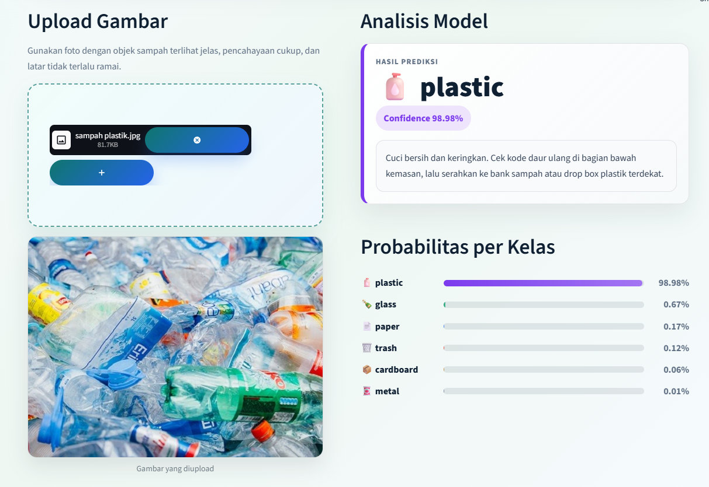
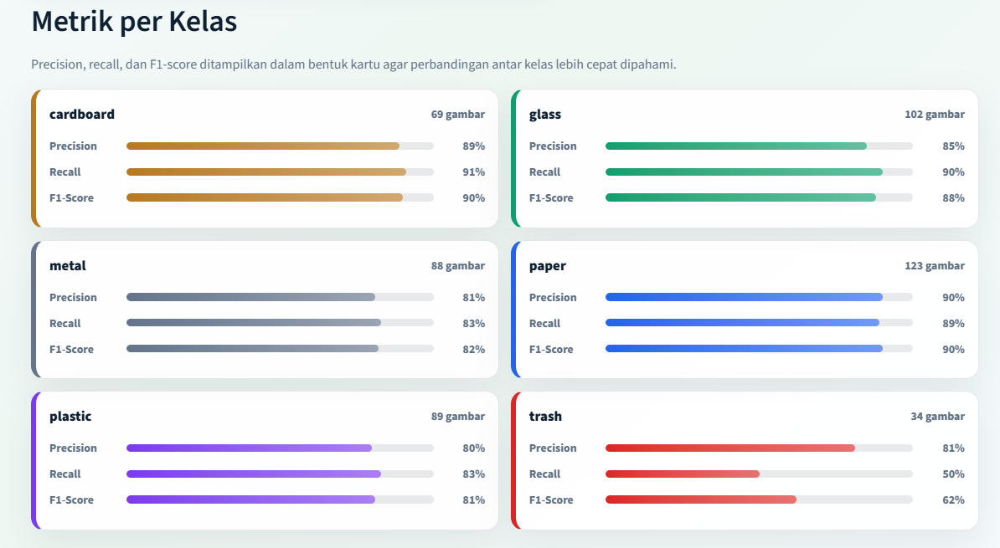

# 🗑️ Garbage Classification — Automatic Waste Classifier

A web app that classifies waste images into 6 categories and provides handling recommendations. Built with MobileNetV2 Transfer Learning and deployed with Streamlit.

**[Try the live demo →](https://garbage-classification-sb.streamlit.app)**



---

## What It Does

- Upload a photo of waste
- The model predicts which category it belongs to
- Shows confidence score for each category
- Gives practical handling advice based on the result

---

## Model Evaluation



| Class | Precision | Recall | F1-Score | Support |
|-------|-----------|--------|----------|---------|
| Cardboard | 0.89 | 0.91 | 0.90 | 69 |
| Glass | 0.85 | 0.90 | 0.88 | 102 |
| Metal | 0.81 | 0.83 | 0.82 | 88 |
| Paper | 0.90 | 0.89 | 0.90 | 123 |
| Plastic | 0.80 | 0.83 | 0.81 | 89 |
| Trash | 0.81 | 0.50 | 0.62 | 34 |

**Overall accuracy: 85%** on 505 validation images.

### Honest Assessment

The model performs well on 5 out of 6 categories (83–91% accuracy), but struggles with the **trash** class — only 50% recall. This is a direct result of class imbalance: the trash class has only 137 training images compared to 500+ for other classes.

This means the model misses roughly 1 in 2 trash images. In a real-world waste sorting system, this would be a significant failure point.

### What Could Be Improved

- Collect more trash class images to fix the imbalance
- Apply class weights during training to penalize misclassification of minority classes
- Fine-tune the MobileNetV2 layers instead of keeping them fully frozen

---

## Technical Details

**Dataset:** [Garbage Classification (Kaggle)](https://www.kaggle.com/datasets/asdasdasasdas/garbage-classification) — 2,527 images, 6 classes

**Why MobileNetV2?** Training a CNN from scratch on 2,527 images would likely overfit badly. MobileNetV2 was pre-trained on ImageNet (1.2M images), so it already knows how to detect shapes, textures, and edges. We only trained the final classification layers on our dataset — a technique called Transfer Learning.

**Training setup:**
- Input size: 224×224 pixels
- Augmentation: random flip, rotation, zoom
- Optimizer: Adam (lr=0.0001)
- Regularization: Dropout (0.5), EarlyStopping (patience=5)
- Best validation accuracy: 85% at epoch 19

## Training Notebook

The full training process — data loading, preprocessing, model building, and evaluation — is documented in the notebook:

📓 [`notebook/garbage_classification_training.ipynb`](notebook/garbage_classification_training.ipynb)

---

## Run Locally

> ⚠️ These instructions are verified on **Windows**. Mac/Linux should work similarly, but Python version compatibility with TensorFlow may vary. TensorFlow currently does not support Python 3.14 — use Python 3.11 or 3.12.

**Requirements:** Python 3.11 or 3.12, Git

```bash
# 1. Clone the repository
git clone https://github.com/init-sb/garbage-classification.git
cd garbage-classification

# 2. Create and activate virtual environment
python -m venv venv

# Windows
venv\Scripts\activate

# Mac/Linux
source venv/bin/activate

# 3. Install dependencies
pip install -r requirements.txt

# 4. Run the app
streamlit run app.py
```

**Common issues:**

- *TensorFlow install fails* — make sure you're using Python 3.11 or 3.12, not 3.13 or 3.14
- *`best_model.keras` not found* — make sure you're running the command from inside the `garbage-classification` folder
- *App loads but prediction fails* — try clearing browser cache or opening in incognito mode

---

## Tech Stack

| Component | Technology |
|-----------|-----------|
| Model | TensorFlow + Keras |
| Base Model | MobileNetV2 (ImageNet weights) |
| Frontend | Streamlit |
| Deployment | Streamlit Cloud |